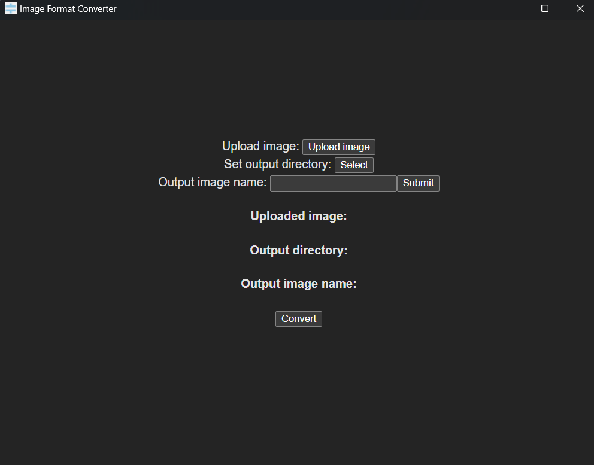

# Image Converter

An app made with Tauri to convert images from `.png` to `.jpg` and vice versa. Made as a way to learn how to use Tauri, and to become more familar with TypeScript and React.

## How to run the converter

Prerequisites can be found [here](https://tauri.app/v1/guides/getting-started/prerequisites).

1. Clone the git repository to a folder.
2. `cd` into the cloned folder.
3. Run `npm run tauri dev` if you are using npm, or `yarn tauri dev` if you are using yarn.

## Preview
